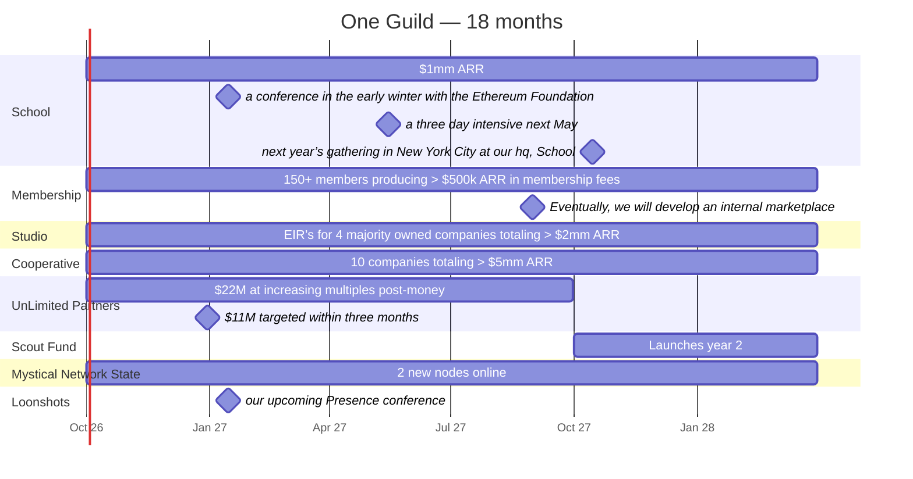
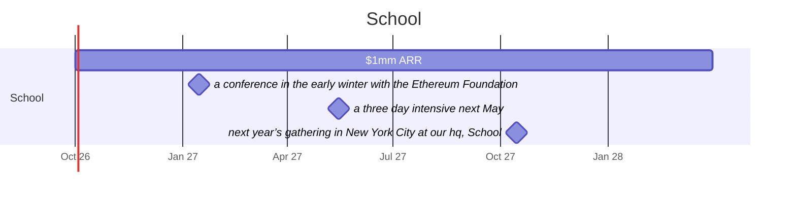
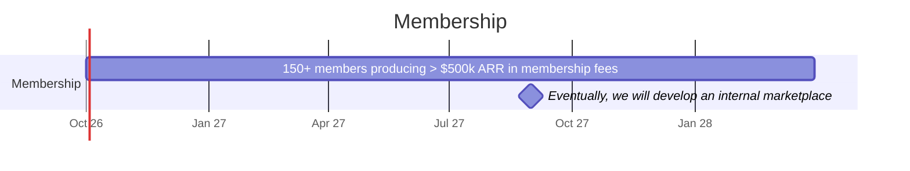
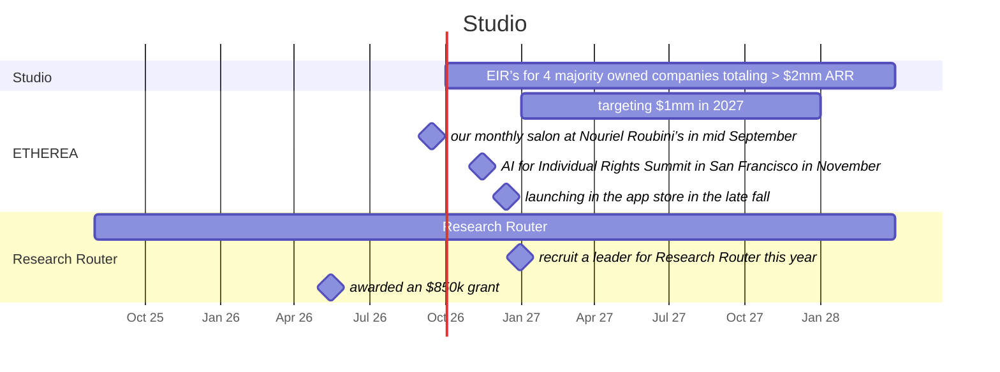
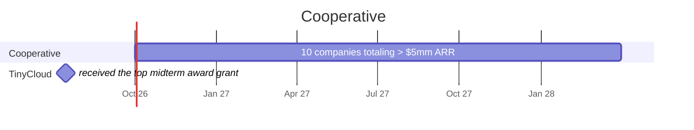
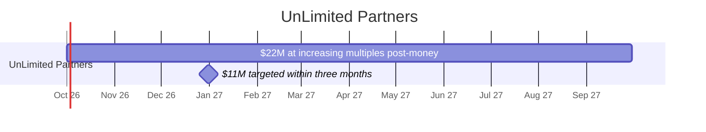
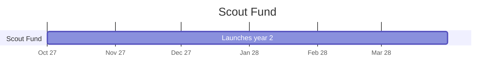
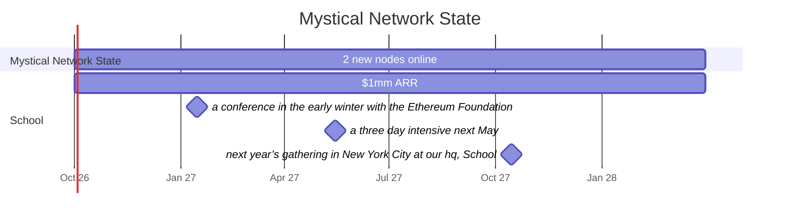
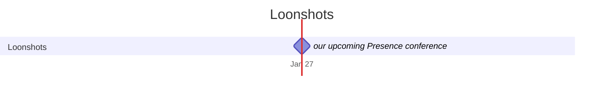

# One Guild — vault export

Generated from one/vault. One section per note, in map-of-content order. `[[Name]]` refers to another section in this file. Frontmatter `status` is canon (vouched), review (drafted, awaiting vouch), or unsettled (still being decided).

---

<!-- note: 00 Prospectus (00 Prospectus.md) -->

---
title: One Guild | Prospectus | Fall 2026
type: theme
status: review
updated: 2026-08-21
owner: "[[James Barnes]], [[John Fagan]]"
aliases: [Prospectus, MOC, Index]
sources:
  - "Google Doc 1PK5MFKTe3QP7CmhJD_oc-l_iCJgbFCB-rUk9NDFa6yY, revision of 2026-08-21"
---
# One Guild | Prospectus | Fall 2026

Friends,

Humans are the least present we have ever been: distracted, divided, and isolated by increasingly lethal demands on our attention from technologies that have commodified it.

We believe that general intelligence can liberate human attention just as it threatens to destroy it. We see a new horizon of presence and connection unlocked by unifying the timeless tools of ritual, ceremony, and togetherness with our emergent capacity to create anything we can imagine. Just as today’s AI takeoff is accelerating human capability across engineering, science, and creativity, we believe that it will equally propel talent, capital, and infrastructure aligned in service of the present moment.

We are doing this today at 25 Dobbin Street, a 28k square foot former parochial [[School|school]] and [[Convent|convent]] on McCarren Park that we are turning into the nexus for the Brooklyn Renaissance.

Our mission is simple, ambitious and timely: Build a Present Future. 

In a present future: 

- SOMETHING ABOUT ABUNDANCE, ALLOCATION ETC
- Frontier technology blends seamlessly with the proven tools of the past to connect us with ourselves, each other, and the earth beneath our feet.
- Cryptography combines with general intelligence to enable us to collaborate without fear, and be vulnerable without exploitation.
- Armed with well-regulated nervous systems, increasingly capable AI allows each of us to become fully self-expressed, creating as we speak to share our deepest potential and uplift all of humanity.
- The values of radical self-reliance and communal effort stand in harmonious balance, scaffolded by our intention and energy to catalyze a renaissance in a beautiful transmutation of inner work to outer value.

Below, we are excited to take you through our plan to fully actualize this dream, including and especially highlighting the journey that got us here and the progress we have made so far.

With great awareness of the lessons of social media and the promise and peril of frontier AI, we believe that today is the exact right moment to act boldly, and look forward to welcoming you aboard our Thesean ship of progress we are assembling for this journey.

As you read, we invite you to dream big, feel deeply, and think hard, applying both your analytical rigor and childlike wonder to imagine the future we are describing and scrutinize the path we are carving to get there. We are eager for your feedback, questions, and suggestions on where to both become more focused and more ambitious. 

With deep gratitude,

[[John Fagan]] and [[James Barnes]]
Managing Partners, ✌🏻One Guild

---

## [[Our Story|Our story]]

> Shortly after meeting at Burning Man in 2022, we joined forty new friends from Brooklyn for a month in Essouria, Morocco which changed the trajectory of both of our lives. In community, we held workshops on the emergent AI phenomenon, learned to kitesurf, threw epic parties where brilliant engineers connected with ex-pat artists, and turned a chance introduction with a local hotel owner into a one-day festival at his villa where we blended some of Brooklyn's best DJs with Omar Hayat, the top Gnawan artist in Morocco. We also held an “AI seance” where we attempted to replicate the findings of the Princeton Engineering Anomalies Research Lab to influence GPT-3 with our minds (the results were not statistically significant). Many interesting projects came out of this time for many in our community. Perhaps the most interesting was Edge City, the proto-network state founded by Timour Kosters, who we are collaborating with on next year’s gathering in New York City at our hq, [[School]].
> — from [[Our Story]]

## [[Thesis|Our Thesis]]

> - [[Presence]]
> - [[Connection]]
> - [[Trust]]
> — from [[Thesis]]

## Our Flywheel

1. [[School]]

   now:: $400k ARR · 18 month goal:: $1mm ARR

   > It all starts with the physical container, our 28,000 sq. ft. complex on McCarren Park in Greenpoint that we are transforming into the nexus for the Brooklyn Renaissance. This campus is split between [[Convent]], a 7,000 sqft 9 bedroom townhouse, attached to School, 21,000 sqft of flexible space for making magic - both buildings collectively providing an additional 3,000 sqft of prime rooftop views of Manhattan.
> — from [[School]]

2. [[Membership]]

   now:: 10 founding members producing $60k ARR currently · 18 month goal:: 150+ members producing > $500k ARR in membership fees

   > Guild members are selected based on their alignment to our values, singular performance and potential in their fields, and commitment to personal growth. Membership has been entirely pull, with no formal program heretofore - only worldbuilders asking us if they can collaborate and contribute money.
> — from [[Membership]]

3. [[Studio]]

   18 month goal:: EIR’s for 4 majority owned companies totaling > $2mm ARR

   > As we have recruited an increasingly talented cohort of founding members, we have seen their interactions consistently produce magic. It has become clear to us that many meaningful projects will be born from within the guild, and are creating the studio as a path to commercialization for the generative creativity that is bubbling out of our walls every day. We have also chosen to build our own pre-existing businesses from within the halls of the Guild, which will assume 51% ownership.
> — from [[Studio]]

4. [[Cooperative]]

   18 month goal:: 10 companies totaling > $5mm ARR

   > For members who have already founded their own companies and are interested in aligning their long-term interests with the Guild, the cooperative pairs investment and mutual exchange of equity to create a tight-knit community of companies who share resources, strategies, and team capacity. We view the cooperative as our most exciting endeavor, where we can test the hypothesis of how excess capacity delivered by AGI can be shared.
> — from [[Cooperative]]

5. [[UnLimited Partners]]

   > # UnLimited Partners
> UnLimited Partners are the economic engine who give One Guild the patient capital to build out of [[School]], launch companies through the [[Studio]], and grow the [[Cooperative|cooperative]]. An UnLimited Partner owns stock in One Guild, Inc., alongside the managing partners and the people who earn ownership by helping build it.
> — from [[UnLimited Partners]]

6. [[Scout Fund]]

   launch:: Launches year 2

   > A growing membership of the world's brightest minds and boldest hearts provides unprecedented access to deal flow across mission-aligned companies that are defining the future. We believe that many of these companies will be born in Brooklyn and will offer all of our members the opportunity to source up to $50,000 in capital to founders they believe in (or even themselves) who submit to evaluation by an in-depth in-person AI interview at  [[School]] followed by a rigorous agentic evaluation process. In the same way that other scout funds have been an effective way for growth funds to find deal flow, we believe that our trust-based network scaffolded by our innovative evaluation process can beat the market in finding promising early-stage deals.
> — from [[Scout Fund]]

7. [[Mystical Network State]]

   18 month goal:: 2 new nodes online

   > 18 month goal:: 2 new nodes online
> by:: March 31, 2028
> Our promise and potential is rooted not just in our people and ideas, but in the physical spaces we steward that allow our membership to work, learn, and grow alongside community.
> — from [[Mystical Network State]]

8. [[Loonshots]]

   > The structures we have described above give us all enormous leverage to coordinate together in service of larger goals, and we plan on using this leverage to accomplish increasingly ambitious cross-functional projects that leverage all of the unique strengths and capabilities of everyone involved in the Guild. We call these Loonshots.
> — from [[Loonshots]]

## [[Timeline]]

# Timeline

| item | label (verbatim) | date | precision |
|---|---|---|---|
| [[School]] | $1mm ARR | 2026-10-01 → 2028-03-31 | horizon |
| [[School]] | a conference in the early winter with the Ethereum Foundation | 2027-01-15 | month |
| [[School]] | a three day intensive next May | 2027-05-15 | month |
| [[School]] | next year’s gathering in New York City at our hq, School | 2027-10-15 | approx |
| [[Membership]] | 150+ members producing > $500k ARR in membership fees | 2026-10-01 → 2028-03-31 | horizon |
| [[Membership]] | Eventually, we will develop an internal marketplace | 2027-08-31 | year |
| [[Studio]] | EIR’s for 4 majority owned companies totaling > $2mm ARR | 2026-10-01 → 2028-03-31 | horizon |
| [[Cooperative]] | 10 companies totaling > $5mm ARR | 2026-10-01 → 2028-03-31 | horizon |
| [[UnLimited Partners]] | $22M at increasing multiples post-money | 2026-10-01 → 2027-09-30 | approx |
| [[UnLimited Partners]] | $11M targeted within three months | 2026-12-31 | month |
| [[Scout Fund]] | Launches year 2 | 2027-10-01 → 2028-03-31 | month |
| [[Mystical Network State]] | 2 new nodes online | 2026-10-01 → 2028-03-31 | horizon |
| [[Loonshots]] | our upcoming Presence conference | 2027-01-15 | month |

Dates are read from each note’s frontmatter (`when`, `milestones`). `precision` says how the date was derived: `day` exact; `month`/`year` the doc names only that; `approx` a phrase like “late fall”; `horizon` the 18-month goal window (2026-10-01 → 2028-03-31; clock starts Oct. 1, 2026 per James, Aug 21 2026). Edit the note, not this file.

— embedded from [[Timeline]]

## [[Cap Table]]

## [[Numbers]]

## Relations

founded_by:: [[James Barnes]]
founded_by:: [[John Fagan]]
located_at:: [[School]]

---

<!-- note: School (engines/School.md) -->

---
title: School
type: engine
status: review
updated: 2026-08-21
aliases: [25 Dobbin Street]
metrics:
  arr_now: "$400k ARR"
  goal_18mo: "$1mm ARR"
when:
  start: 2026-10-01
  end: 2028-03-31
  label: "$1mm ARR"
  precision: horizon
milestones:
  - label: "a conference in the early winter with the Ethereum Foundation"
    date: 2027-01-15
    precision: month
    note: "the Presence conference — January 2027; Ethereum Foundation confirmed; exact dates TBD — JB, Aug 21 2026"
  - label: "a three day intensive next May"
    date: 2027-05-15
    precision: month
    note: "booked for May 2027; exact dates TBD — JB, Aug 21 2026"
  - label: "next year’s gathering in New York City at our hq, School"
    date: 2027-10-15
    precision: approx
    note: "Fall 2027 — JB, Aug 21 2026"
sources:
  - "Google Doc 1PK5MFKTe3QP7CmhJD_oc-l_iCJgbFCB-rUk9NDFa6yY, revision of 2026-08-21"
---
# School

now:: $400k ARR
18 month goal:: $1mm ARR
by:: March 31, 2028

It all starts with the physical container, our 28,000 sq. ft. complex on McCarren Park in Greenpoint that we are transforming into the nexus for the Brooklyn Renaissance. This campus is split between [[Convent]], a 7,000 sqft 9 bedroom townhouse, attached to School, 21,000 sqft of flexible space for making magic - both buildings collectively providing an additional 3,000 sqft of prime rooftop views of Manhattan. 
^intro

In addition to being the home for the guild and the first node in our [[Mystical Network State|network state]], It offers multiple revenue streams that support our other activities with a growing and synergistic business today:

**TV/Film & Events:** Even before we moved in, School and its auditorium were popular shooting locations for TV and film productions. We have continued this practice, which can routinely produce $15-20,000/day in revenue l, offsetting the monthly rent and overhead for the entire school. 

**Short-term rentals:** We recently hosted a 10-week accelerator sponsored by Flashbots, the Stanford Blockchain Builders Fund, and the Cornell Institute for Cryptocurrency and Contracts. We are closing a deal with a recently acquired startup (>$600m) to relocate their headquarters while their offices are renovated. Short-term rentals like this allow us to maintain flexibility, welcome new and interesting people into the community, and charge competitive rates.

**Conferences:** Our experience in hosting the accelerator for Flashbots also gave us our first taste of producing a conference, with a two-day final demo day featuring many of the products built from within School and high-profile speakers like Vitalik Buterin, Ethereum founder, and visualized by the Guild’s own [[ETHEREA]]. We will continue to host conferences aligned with our values that are revenue positive and build a brand for School as a place where important and beautiful things happen.We have already booked Richard Schwarz, the founder of Internal Family Systems, for a three day intensive next May, among others. To catalyze this, we will host a conference in the early winter with the Ethereum Foundation, [sponsor 2], and [sponsor 3]  exploring the intersection themes that animate School - pro-social technology, immersive art, and consciousness expansion.

**Dinners:** In Convent’s first season, we hosted a Michelin-star chef who created magical dinners for audiences ranging from top-tier VCs to critically acclaimed artists and world-renowned DJs. Eating well has become a foundation of our community here, and we hope to become a long-term magnet and revenue source. Our industrial kitchen, magically projection-mapped dining rooms, and close proximity to high-quality ingredients makes us a fantastic location for external dinners and a great foundation for the guild to host some of New York's most interesting people for fantastic meals.

**Parties and cultural programming:** 

## Timeline

# Timeline — School

| item | label (verbatim) | date | precision |
|---|---|---|---|
| [[School]] | $1mm ARR | 2026-10-01 → 2028-03-31 | horizon |
| [[School]] | a conference in the early winter with the Ethereum Foundation | 2027-01-15 | month |
| [[School]] | a three day intensive next May | 2027-05-15 | month |
| [[School]] | next year’s gathering in New York City at our hq, School | 2027-10-15 | approx |

Dates are read from each note’s frontmatter (`when`, `milestones`). `precision` says how the date was derived: `day` exact; `month`/`year` the doc names only that; `approx` a phrase like “late fall”; `horizon` the 18-month goal window (2026-10-01 → 2028-03-31; clock starts Oct. 1, 2026 per James, Aug 21 2026). Edit the note, not this file.

— embedded from [[Timeline — School]]

## Relations

part_of:: [[Mystical Network State]]

## Numbers

See [[Numbers]].

## Doc comments

> [!quote] [b]
> School Address: 29 Nassau
> One Address: 25 Dobbin
> Same building - too confusing?
> i just want to differentiate that theyre related but distinct

> [!quote] [h]
> link to video or pictures

---

<!-- note: Our Story (events/Our Story.md) -->

---
title: Our Story
type: theme
status: review
updated: 2026-08-21
aliases: [Our story]
sources:
  - "Google Doc 1PK5MFKTe3QP7CmhJD_oc-l_iCJgbFCB-rUk9NDFa6yY, revision of 2026-08-21"
---

# Our story

Shortly after meeting at Burning Man in 2022, we joined forty new friends from Brooklyn for a month in Essouria, Morocco which changed the trajectory of both of our lives. In community, we held workshops on the emergent AI phenomenon, learned to kitesurf, threw epic parties where brilliant engineers connected with ex-pat artists, and turned a chance introduction with a local hotel owner into a one-day festival at his villa where we blended some of Brooklyn's best DJs with Omar Hayat, the top Gnawan artist in Morocco. We also held an “AI seance” where we attempted to replicate the findings of the Princeton Engineering Anomalies Research Lab to influence GPT-3 with our minds (the results were not statistically significant). Many interesting projects came out of this time for many in our community. Perhaps the most interesting was Edge City, the proto-network state founded by Timour Kosters, who we are collaborating with on next year’s gathering in New York City at our hq, [[School]].
^intro

The next month, we kept the momentum by renting a mansion in Malibu, shooting a pilot of an AI-powered dating show, absolutely gobsmacked by the creative potential we had discovered in ourselves and our community (and also very humbled by the difficulty of making a television show). We soon reunited with our Morocco crew to co-create the Calling All Magical People festival, which reified a growing belief in the cultural frontier of Brooklyn and in the possibility of living a life full of presence, play, trust, and connection. 

In the years after, the twists and turns of entrepreneurship led [[James Barnes|James]] to invent [[ETHEREA]], a new speech visualization technology after raising $3 million and launch an AI biographer with Katie Couric, and [[John Fagan|John]] to discover an increasingly Rick Rubin-esque ability to identify and develop talent while creating the world's most advanced ketamine therapy and sound protocol in [[Hohm]]. 

After time pursuing independent paths, we reunited in January of last year, having inexplicably gained temporary stewardship over the former site of Florent, a historic restaurant in the Meatpacking District. A number of synchronicities (including the property’s owner having been one of John’s biggest clients at his first startup, Doorkee) and aligned missions  inspired the owner to give us permission to do whatever we wanted with the landmark space. In just three months, we hosted an AI variety show, curated a pop-up gallery to spotlight our friends art , helped Oobah Butler produce part of his new avant-garde A24 & HBO Mockumentary, and threw a few more epic parties and Hohm journeys that we will never forget. We also turned its prime location on Gansevoort Street into a public art installation by projecting ETHEREA through the front windows where people on the street could control the display with their voices.

A chance encounter with someone retrieving vibroacoustic beds we had been lent for a journey led us to discover [[Convent]], a 110-year-old former convent on McCarren Park and attached parochial school on the border of Greenpoint and Williamsburg, which quickly became our home and under our stewardship.  After a few months, 69 Gansevoort was sold, but not before gaining us long-term relationships with the owner, a new and exciting home in Convent and School, and a widened perspective on building community with physical space in New York City.

We have been iterating elements of ONE since our magical month in Morocco, and now find, at the dawn of this new age for humanity, that our partnership's ability to manifest abundance is being called on by the muse to serve as a transformative voice in our new society. Below, we present early evidence of our progress and ambitious plans to bring this magic to a society that needs it.

## Relations

precedes:: [[School]]

## Open

> [!todo]
> "after raising $3 million" is wrong: the $3mm raise was for Autobiographer (the AI biographer with Katie Couric), not ETHEREA. Sentence awaits James’s rewording. — Aug 21 2026

---

<!-- note: Thesis (terms/Thesis.md) -->

---
title: Thesis
type: theme
status: review
updated: 2026-08-21
aliases: [Our Thesis]
sources:
  - "Google Doc 1PK5MFKTe3QP7CmhJD_oc-l_iCJgbFCB-rUk9NDFa6yY, revision of 2026-08-21"
---

# Our Thesis

- [[Presence]]
- [[Connection]]
- [[Trust]]
^intro

---

<!-- note: Membership (engines/Membership.md) -->

---
title: Membership
type: engine
status: review
updated: 2026-08-21
aliases: []
metrics:
  now: "10 founding members producing $60k ARR currently"
  now_note: "count 10 confirmed; ARR unsettled — cash vs in-kind dues to be reconciled by James & John (Aug 21 2026)"
  goal_18mo: "150+ members producing > $500k ARR in membership fees"
when:
  start: 2026-10-01
  end: 2028-03-31
  label: "150+ members producing > $500k ARR in membership fees"
  precision: horizon
milestones:
  - label: "Eventually, we will develop an internal marketplace"
    date: 2027-08-31
    precision: year
sources:
  - "Google Doc 1PK5MFKTe3QP7CmhJD_oc-l_iCJgbFCB-rUk9NDFa6yY, revision of 2026-08-21"
---
# Membership

now:: 10 founding members producing $60k ARR currently
18 month goal:: 150+ members producing > $500k ARR in membership fees
by:: March 31, 2028

Guild members are selected based on their alignment to our values, singular performance and potential in their fields, and commitment to personal growth. Membership has been entirely pull, with no formal program heretofore - only worldbuilders asking us if they can collaborate and contribute money. 
^intro

Membership is our top-of-the-funnel for talent in the Guild and is currently diversified across many different offerings, from exited founders to commercially successful musicians and installation artists. As a Guild, we take membership seriously. It is the oldest structure for keeping craft alive, and it means three things:
- a mutual dedication to our mastery of craft
- the in-person transmission of knowledge and wisdom
- the careful curation of who belongs
  
We have found that, in each other, Guild members have discovered fellow travelers who encourage them and challenge them to go further in their individual endeavors while collaborating on new shared visions. Today, our small but growing community of guild members has received enormous value from one another trading spare engineering cycles, advisory hours, physical labor, and even industrial design. 

Eventually, we will develop an internal marketplace that allows for the companies or the members of the guild to grant small amounts of equity in the Guild in exchange for helping each other. Our vision is for members to be able to collaborate to utilize excess cycles to help each other in a way that is mutually beneficial for everyone in the community. We are exploring many different ways of enabling this type of commerce, including making use of our community's deep blockchain and Web3 knowledge to stay on the bleeding edge of what is possible while incorporating the lessons of the past.

In addition to being interviewed and selected by new managing partners, members pay dues (currently on a sliding scale of $300 to $1,000 per month for founding members, which we will increase over time as things evolve), with benefits including:
- Coworking inside [[School]]
- members-only programming
- access to and member rates for other nodes in our [[Mystical Network State|network state]]
- internal space rentals at below market costs
- the ability to refer and invest in projects through both the [[Scout Fund|Scout fund]] and as an [[UnLimited Partners|unlimited partner]]
In our first 18 months, we are intentionally limiting our growth in memberships to 150 people, which, known as Dunbar's number, is the number of relationships any human can hold in their head at any given time. As we expand geographic nodes in our mystical network state, we plan on opening up new capacity such that each location can maintain a cohesive community.

## Timeline

# Timeline — Membership

| item | label (verbatim) | date | precision |
|---|---|---|---|
| [[Membership]] | 150+ members producing > $500k ARR in membership fees | 2026-10-01 → 2028-03-31 | horizon |
| [[Membership]] | Eventually, we will develop an internal marketplace | 2027-08-31 | year |

Dates are read from each note’s frontmatter (`when`, `milestones`). `precision` says how the date was derived: `day` exact; `month`/`year` the doc names only that; `approx` a phrase like “late fall”; `horizon` the 18-month goal window (2026-10-01 → 2028-03-31; clock starts Oct. 1, 2026 per James, Aug 21 2026). Edit the note, not this file.

— embedded from [[Timeline — Membership]]

## Relations

located_at:: [[School]]

## Numbers

See [[Numbers]].

## Doc comments

> [!quote] [a]
> i dont think its necessarily one community per node at all, we should cut that

> [!quote] [d]
> membership should now be at like 10 (including you, me, alexis, ross, dmarz, mike A, Amanda) some of us are giving our dues in kind but can book it as revenue

---

<!-- note: Studio (engines/Studio.md) -->

---
title: Studio
type: engine
status: review
updated: 2026-08-21
aliases: []
metrics:
  goal_18mo: "EIR’s for 4 majority owned companies totaling > $2mm ARR"
when:
  start: 2026-10-01
  end: 2028-03-31
  label: "EIR’s for 4 majority owned companies totaling > $2mm ARR"
  precision: horizon
milestones: []
sources:
  - "Google Doc 1PK5MFKTe3QP7CmhJD_oc-l_iCJgbFCB-rUk9NDFa6yY, revision of 2026-08-21"
---

# Studio

18 month goal:: EIR’s for 4 majority owned companies totaling > $2mm ARR
by:: March 31, 2028

As we have recruited an increasingly talented cohort of founding members, we have seen their interactions consistently produce magic. It has become clear to us that many meaningful projects will be born from within the guild, and are creating the studio as a path to commercialization for the generative creativity that is bubbling out of our walls every day. We have also chosen to build our own pre-existing businesses from within the halls of the Guild, which will assume 51% ownership.
^intro

After studying the stories of many venture studios over the past few decades, we are especially inspired by Mike Spieser at Sutter Hill Ventures, and believe that his thoughtful and deliberate success offers a lesson on how to build a successful studio in the Intelligence Age:

1. At any given time, [[John Fagan|John]] and [[James Barnes|James]] will lead between 1-2 studio projects each, starting with [[ETHEREA]], [[Hohm|Hohm / Templar]],  [[Research Router]], and [[School]], and will be judged by finding a killer replacement once demand exceeds operational capacity.

2. Studio projects will be picked thoughtfully and deliberately based on the input of the members and contribution to the mission. We will explicitly reject the rapid validation model of many of the past era’s Venture Studios in favor of the conviction-driven, partner-led approach employed by Sutter Hill.

3. The Studio will own > 51% of Studio companies as cofounders, and will compensate CEO’s with a substantial mix of guild equity and company equity. Contributing members will be rewarded with equity proportional to their contribution.

4. Over time, James and John may choose to add new partners capable of incubating and launching new projects.

Here is more information about the initial batch of Studio projects:

- [[ETHEREA]]
- [[Hohm]]
- [[Research Router]]

## Timeline

# Timeline — Studio

| item | label (verbatim) | date | precision |
|---|---|---|---|
| [[Studio]] | EIR’s for 4 majority owned companies totaling > $2mm ARR | 2026-10-01 → 2028-03-31 | horizon |
| [[ETHEREA]] | targeting $1mm in 2027 | 2027-01-01 → 2027-12-31 | year |
| [[ETHEREA]] | our monthly salon at Nouriel Roubini’s in mid September | 2026-09-15 | approx |
| [[ETHEREA]] | AI for Individual Rights Summit in San Francisco in November | 2026-11-15 | month |
| [[ETHEREA]] | launching in the app store in the late fall | 2026-12-15 | month |
| [[Research Router]] |  | 2025-08-01 → 2028-03-31 | approx |
| [[Research Router]] | recruit a leader for Research Router this year | 2026-12-31 | year |
| [[Research Router]] | awarded an $850k grant | 2026-05-15 | month |

Dates are read from each note’s frontmatter (`when`, `milestones`). `precision` says how the date was derived: `day` exact; `month`/`year` the doc names only that; `approx` a phrase like “late fall”; `horizon` the 18-month goal window (2026-10-01 → 2028-03-31; clock starts Oct. 1, 2026 per James, Aug 21 2026). Edit the note, not this file.

— embedded from [[Timeline — Studio]]

## Relations

depends_on:: [[Cap Table]]
located_at:: [[School]]

## Numbers

See [[Numbers]].

## Doc comments

> [!quote] [g]
> studio needs rewriting

---

<!-- note: Cooperative (engines/Cooperative.md) -->

---
title: Cooperative
type: engine
status: review
updated: 2026-08-21
aliases: [co-op]
metrics:
  goal_18mo: "10 companies totaling > $5mm ARR"
  check_size: "$500,000 to $1 million"
  target_ownership: "10%"
when:
  start: 2026-10-01
  end: 2028-03-31
  label: "10 companies totaling > $5mm ARR"
  precision: horizon
milestones: []
sources:
  - "Google Doc 1PK5MFKTe3QP7CmhJD_oc-l_iCJgbFCB-rUk9NDFa6yY, revision of 2026-08-21"
---

# Cooperative

18 month goal:: 10 companies totaling > $5mm ARR
by:: March 31, 2028

For members who have already founded their own companies and are interested in aligning their long-term interests with the Guild, the cooperative pairs investment and mutual exchange of equity to create a tight-knit community of companies who share resources, strategies, and team capacity. We view the cooperative as our most exciting endeavor, where we can test the hypothesis of how excess capacity delivered by AGI can be shared.
^intro

We target 10% ownership of companies in the cooperative, divided in half between investment and Founder Common stock, vesting over a period of time in exchange for the Guild’s contributions, and view this position as analogous to another co-founder in the company. Companies will have access to shared engineering, design, and marketing resources, as well as leadership coaching, group experiences and retreats, and a common pedagogy for self actualization. As is common in holding companies that offer shared services, we will create a credit system for shared resources, which will allow us to prioritize and economize based on the needs of each company at each time. From time to time, we will also organize sprints and support of a single cooperative company, where everyone in the guild might spend between one to five days helping them solve core business problems. 

The mutual exchange of equity, in addition to the discrete allocation described above in the [[Membership|membership section]], will enable fluidity between companies and for founders in the co-op to be able to hedge their own possibility of an exit with the overall success of our portfolio. In a world where founders increasingly see substantial exits marred by unfavorable terms with investors, we believe that this early-stage support with confidence in shared success among peers, paired with a later-stage growth fund with participation from many partners across the ecosystem, will create a different paradigm for mission-aligned founders looking for long-term sustainability.

Check sizes will typically range from $500,000 to $1 million, and valuation will come in at the greater of $10 million or the last round's valuation, with the remaining percentage covered by founder common stock vesting over four years in exchange for shared services.

Current Companies

- [[TinyCloud]]
- [[SECO]]
- [[Meridial]]
- [[Smithers]]

## Timeline

# Timeline — Cooperative

| item | label (verbatim) | date | precision |
|---|---|---|---|
| [[Cooperative]] | 10 companies totaling > $5mm ARR | 2026-10-01 → 2028-03-31 | horizon |
| [[TinyCloud]] | received the top midterm award grant | 2026-07-15 | month |

Dates are read from each note’s frontmatter (`when`, `milestones`). `precision` says how the date was derived: `day` exact; `month`/`year` the doc names only that; `approx` a phrase like “late fall”; `horizon` the 18-month goal window (2026-10-01 → 2028-03-31; clock starts Oct. 1, 2026 per James, Aug 21 2026). Edit the note, not this file.

— embedded from [[Timeline — Cooperative]]

## Relations

## Numbers

See [[Numbers]].

## Doc comments

> [!quote] [f]
> Coop: checks: 500-1m; 10 CO's

> [!quote] [i]
> why?

## Open

> [!todo]
> Valuation term (re doc comment [i] "why?"): the $10 million floor is superseded. James, Aug 21 2026: "either last round or we will determine if you've never raised, somewhere between $5-15mm". The sentence "valuation will come in at the greater of $10 million or the last round's valuation" awaits its replacement wording.

---

<!-- note: UnLimited Partners (engines/UnLimited Partners.md) -->

---
title: UnLimited Partners
type: engine
status: review
updated: 2026-08-21
aliases: [UnLimited Partners, ULP, ULPs]
when:
  start: 2026-10-01
  end: 2027-09-30
  label: "$22M at increasing multiples post-money"
  precision: approx
  note: "UNSETTLED — written version (site + plan, Aug 16 2026); four raise versions still in circulation, reconciliation with John pending"
milestones:
  - label: "$11M targeted within three months"
    date: 2026-12-31
    precision: month
    note: "UNSETTLED — first close; three months from the Oct. 1, 2026 clock — JB, Aug 21 2026"
sources:
  - "Google Doc 1PK5MFKTe3QP7CmhJD_oc-l_iCJgbFCB-rUk9NDFa6yY, revision of 2026-08-21"
---

# UnLimited Partners
UnLimited Partners are the economic engine who give One Guild the patient capital to build out of [[School]], launch companies through the [[Studio]], and grow the [[Cooperative|cooperative]]. An UnLimited Partner owns stock in One Guild, Inc., alongside the managing partners and the people who earn ownership by helping build it.
^intro
We built the Guild to be held. We do not intend to sell the Guild or take it public, and our strategy explicitly does not depend on either outcome. The value we create for our members and ULC far exceeds the tangible ROI, and beyond certain scale the dilution of these benefits outstrips the marginal liquidity.  We expect to reinvest most of the cash the Guild generates - and most of the proceeds from the companies it creates -into  future studio company, the next node, and the shared institutions that make the network more valuable. Capital that remains in the family continues compounding for everyone who remains part of it.
We also want to make long-term ownership worth your while without making it permanent.
The Guild will distribute dividends ongoing, as well as open eligible liquidity windows following a meaningful liquidity event, when it has surplus cash beyond its operating needs and reserves, or when an approved buyer wants to join the ownership group. These windows will not necessarily occur on a fixed annual schedule.
At an eligible liquidity window, an UnLimited Partner has three choices:
1. Remain fully invested. The partner keeps their entire position and continues participating in the Guild’s growth (see below for incentives to remain fully invested).
2. Take modest liquidity. The partner may offer up to 25% of their holdings for repurchase while remaining an UnLimited Partner and retaining the benefits of continued participation.
3. Make a clean exit. A partner who wants more than partial liquidity may offer their entire position for sale. The Guild may satisfy that request through a company repurchase, another UnLimited Partner, or an approved new investor.
This is an intentional choice between staying meaningfully invested and leaving cleanly. We do not want partners slowly hollowing out their ownership while continuing to hold the access and privileges of a full participant. At the same time, the 25% option allows someone to recover capital, manage risk, or realize part of the value they helped create without leaving the family.
All purchases remain subject to available funds, applicable law, and buyer demand. If a liquidity window is oversubscribed, the available pool will be allocated according to published terms. A request for a complete exit will be treated as all-or-nothing rather than converted into an unintended partial sale.
## Making it worthwhile to stay
Remaining an UnLimited Partner carries benefits beyond continued ownership of the Guild.
When a company spins out of the Studio, UnLimited Partners receive priority access to invest alongside the Guild through a dedicated vehicle. Those investments can return proceeds directly when the underlying company distributes cash or exits.
UnLimited Partners also receive priority allocation in the Guild’s separately structured Growth Funds, which invest behind outside leads and return proceeds through conventional fund distributions.
Partners who recycle proceeds into future Guild vehicles may receive published loyalty terms, including priority allocation and reduced fees or carry where appropriate. These incentives will be offered through consistent programs available to similarly situated partners, rather than negotiated privately through side letters.
The result is a relationship with several layers: ownership in the compounding Guild, direct participation in individual studio companies, and access to funds designed to return cash. An UnLimited Partner can take some liquidity when it is available without surrendering that relationship, or make a complete exit when the relationship has run its course.
## A future network token
The Guild’s membership, credits, and network of nodes may eventually be represented by a digital token: a shared instrument for access, participation, reputation, or governance across the network.
If the Guild or an affiliated issuer creates such an instrument, UnLimited Partners will receive pro-rata rights to the investor allocation based on their fully diluted ownership of One Guild at the time of issuance. Those rights follow the shares: a partner who has taken partial liquidity participates according to their remaining ownership, while a partner who has exited completely no longer retains a claim through shares they no longer own.
The exact issuer, allocation, lockups, transfer restrictions, and regulatory terms will be established in the definitive financing documents. We are not promising a token on a particular timeline. We are promising that if the Guild creates one, the investors who own the Guild will participate fairly in the value it creates.

## Timeline

# Timeline — UnLimited Partners

| item | label (verbatim) | date | precision |
|---|---|---|---|
| [[UnLimited Partners]] | $22M at increasing multiples post-money | 2026-10-01 → 2027-09-30 | approx |
| [[UnLimited Partners]] | $11M targeted within three months | 2026-12-31 | month |

Dates are read from each note’s frontmatter (`when`, `milestones`). `precision` says how the date was derived: `day` exact; `month`/`year` the doc names only that; `approx` a phrase like “late fall”; `horizon` the 18-month goal window (2026-10-01 → 2028-03-31; clock starts Oct. 1, 2026 per James, Aug 21 2026). Edit the note, not this file.

— embedded from [[Timeline — UnLimited Partners]]

## Relations

depends_on:: [[Cap Table]]

## Doc comments

> [!quote] [c]
> remove "guild liquidity" from ULP section, seems like were using patrons for liquidity. Aldo make capitalization UnLimited Partners

## Open

> [!todo]
> The raise (unsettled, Aug 21 2026). Written version, from the live site and plan Terms page (Aug 16): $22M at increasing multiples post-money; first close $11M targeted within three months; remainder in tranches over the following 6–12 months; earlier investors get better valuation, final pricing mechanics in counsel review; ULPs only; future raises primarily debt plus a targeted sidecar. Three other versions are still in circulation ($4–7M first close; ~$7M in three months; $1M next increment), and Patrick’s MFN promise conflicts with tiered multiples. On the timeline as unsettled until James and John reconcile ("One Raise, One Story").

---

<!-- note: Scout Fund (engines/Scout Fund.md) -->

---
title: Scout Fund
type: engine
status: review
updated: 2026-08-21
aliases: [Scout fund]
metrics:
  launch: "Launches year 2"
  check: "up to $50,000"
when:
  start: 2027-10-01
  end: 2028-03-31
  label: "Launches year 2"
  precision: month
  note: "October 2027 — JB, Aug 21 2026"
milestones: []
sources:
  - "Google Doc 1PK5MFKTe3QP7CmhJD_oc-l_iCJgbFCB-rUk9NDFa6yY, revision of 2026-08-21"
---

# Scout Fund

launch:: Launches year 2
by:: October 2027

A growing membership of the world's brightest minds and boldest hearts provides unprecedented access to deal flow across mission-aligned companies that are defining the future. We believe that many of these companies will be born in Brooklyn and will offer all of our members the opportunity to source up to $50,000 in capital to founders they believe in (or even themselves) who submit to evaluation by an in-depth in-person AI interview at  [[School]] followed by a rigorous agentic evaluation process. In the same way that other scout funds have been an effective way for growth funds to find deal flow, we believe that our trust-based network scaffolded by our innovative evaluation process can beat the market in finding promising early-stage deals.
^intro

While we will have no firm geographic requirements, the scout fund evaluation process will bias towards founders living in Brooklyn, New York City, and the rest of the world, in that order.  Understanding false negatives and false positives, we’ll be able to calibrate the agent to each member, understanding where they are believable, and tune the model to synthesize our community’s best insights to make better decisions while helping members improve in evaluating opportunities. Over time, as AI agents grow increasingly capable of synthesizing multi-dimensional information to evaluate investment decisions , we believe that training through this low-risk experimentation will prepare us to use this technology with higher stakes. We view this as a stake in the ground on day one for our commitment to collective stewardship of capital.

## Timeline

# Timeline — Scout Fund

| item | label (verbatim) | date | precision |
|---|---|---|---|
| [[Scout Fund]] | Launches year 2 | 2027-10-01 → 2028-03-31 | month |

Dates are read from each note’s frontmatter (`when`, `milestones`). `precision` says how the date was derived: `day` exact; `month`/`year` the doc names only that; `approx` a phrase like “late fall”; `horizon` the 18-month goal window (2026-10-01 → 2028-03-31; clock starts Oct. 1, 2026 per James, Aug 21 2026). Edit the note, not this file.

— embedded from [[Timeline — Scout Fund]]

## Relations

## Numbers

See [[Numbers]].

## Doc comments

> [!quote] [e]
> scout fund needs rewiring, 50k per member isnt correct and sounds confusing.

> [!quote] [j]
> lets include top of funnel idea of Say interviewing every person who comes to School for how they can support and benefit from guild, and then they recommend 1 person that is ideal for our mission, and them both being eligible for prizes to support them and their work

## Open

> [!todo]
> Re doc comment [e]: the scout check is $50,000 per deal, not per member (James, Aug 21 2026). The sentence "source up to $50,000 in capital" awaits rewording.

---

<!-- note: Mystical Network State (engines/Mystical Network State.md) -->

---
title: Mystical Network State
type: engine
status: review
updated: 2026-08-21
aliases: [Network State, network state, mystical network state]
metrics:
  goal_18mo: "2 new nodes online"
when:
  start: 2026-10-01
  end: 2028-03-31
  label: "2 new nodes online"
  precision: horizon
  note: "James, Aug 21 2026: \"i think it means two papered deals with reciprocal value\""
milestones: []
sources:
  - "Google Doc 1PK5MFKTe3QP7CmhJD_oc-l_iCJgbFCB-rUk9NDFa6yY, revision of 2026-08-21"
---

# Mystical Network State

18 month goal:: 2 new nodes online
by:: March 31, 2028
Our promise and potential is rooted not just in our people and ideas, but in the physical spaces we steward that allow our membership to work, learn, and grow alongside community.
^intro

Above the entrance to a monastery on Mount Athos: "If you die before you die, then you won't die when you die." That line describes the Eleusinian Mysteries, the initiation that ran in Greece for nearly two thousand years and sent every initiate home unafraid of death. Athens guarded it the way it guarded its treasury. One is rebuilding that machinery for a society that has lost its way, and instantiating its impact into physical reality with grounded investments.

A network state organizes a community first around shared values and digital coordination, gradually integrates economically, then acquires physical territory to match. One Guild adds the layers this tech-centric pattern is missing: spirit. 

One’s partnership with landed communities and nodes already in existence is the pilot. We plan to invest and develop over time, as scale calls.  Our community will eventually operate out of multiple privately owned and operated real estate vehicles, run the way a REIT is run, with no exit clock. Nobody is holding these parcels to sell them. Value comes from what the land and buildings do while we hold them: membership dues and programming, communities that form on the property and stay, long term stays by nomadic members, retreats, and vacation travel. The compounding is in the use, not in a future sale, and every node is bought and built with that horizon in mind.
## Nodes
The network already touches six physical properties, in various stages of build or affiliation. [[School|The School]], in Brooklyn, is live. 

We have informal access and deep connections with: Carter Cleveland’s (Guild member and founder of [[SECO|Seco]]) project upstate is underway and already hosting an Edge City popup; Apapacha, an eco-land preserve and development in Zipolite, Mexico; The Thyme is an 85-acre wonderland for creativity, explorations in nature, and human connection in the Berkshires, affiliated nodes. Yoko Village is an eco-village in Santa Teresa, co-founded by a member of the Guild. The 18-month goal is formalizing these partnerships, and getting two more nodes online.

## Timeline

# Timeline — Mystical Network State

| item | label (verbatim) | date | precision |
|---|---|---|---|
| [[Mystical Network State]] | 2 new nodes online | 2026-10-01 → 2028-03-31 | horizon |
| [[School]] | $1mm ARR | 2026-10-01 → 2028-03-31 | horizon |
| [[School]] | a conference in the early winter with the Ethereum Foundation | 2027-01-15 | month |
| [[School]] | a three day intensive next May | 2027-05-15 | month |
| [[School]] | next year’s gathering in New York City at our hq, School | 2027-10-15 | approx |

Dates are read from each note’s frontmatter (`when`, `milestones`). `precision` says how the date was derived: `day` exact; `month`/`year` the doc names only that; `approx` a phrase like “late fall”; `horizon` the 18-month goal window (2026-10-01 → 2028-03-31; clock starts Oct. 1, 2026 per James, Aug 21 2026). Edit the note, not this file.

— embedded from [[Timeline — Mystical Network State]]

## Relations

## Numbers

See [[Numbers]].

---

<!-- note: Loonshots (engines/Loonshots.md) -->

---
title: Loonshots
type: engine
status: review
updated: 2026-08-21
aliases: []
when: null
milestones:
  - label: "our upcoming Presence conference"
    date: 2027-01-15
    precision: month
    note: "same event as School’s early-winter conference with the Ethereum Foundation — JB, Aug 21 2026"
sources:
  - "Google Doc 1PK5MFKTe3QP7CmhJD_oc-l_iCJgbFCB-rUk9NDFa6yY, revision of 2026-08-21"
---

# Loonshots

The structures we have described above give us all enormous leverage to coordinate together in service of larger goals, and we plan on using this leverage to accomplish increasingly ambitious cross-functional projects that leverage all of the unique strengths and capabilities of everyone involved in the Guild. We call these Loonshots.
^intro

A Loonshot, inspired by Safi Bachall’s bestselling book, is defined as two or more guild companies working together on a societally important problem that neither could solve alone. As an example, the [[Research Router]]’s highly ambitious goal of networking the world’s scientists with collective bargaining power over their data depends upon [[TinyCloud]]’s sovereign data infrastructure, will be explored in great depth at our upcoming Presence conference, and finds an ideal customer in [[Meridial]] and their adjacent ARIA cohort.

Here are a few other Loonshots that we’re currently exploring:

## Experiences

- A stadium-scale legal psychedelic ceremony:
- An AI-powered Sleep No More at [[School]]

## Media

- An oral history of the world
- The next TED

## Technology

- A frontier model for inquiry
- A brain visualizer

## Timeline

# Timeline — Loonshots

| item | label (verbatim) | date | precision |
|---|---|---|---|
| [[Loonshots]] | our upcoming Presence conference | 2027-01-15 | month |

Dates are read from each note’s frontmatter (`when`, `milestones`). `precision` says how the date was derived: `day` exact; `month`/`year` the doc names only that; `approx` a phrase like “late fall”; `horizon` the 18-month goal window (2026-10-01 → 2028-03-31; clock starts Oct. 1, 2026 per James, Aug 21 2026). Edit the note, not this file.

— embedded from [[Timeline — Loonshots]]

## Relations

depends_on:: [[Studio]]
depends_on:: [[Cooperative]]

---

<!-- note: Numbers (ledger/Numbers.md) -->

---
title: Numbers
type: term
status: review
updated: 2026-08-21
aliases: [Ledger]
sources:
  - "Google Doc 1PK5MFKTe3QP7CmhJD_oc-l_iCJgbFCB-rUk9NDFa6yY, revision of 2026-08-21"
---

# Numbers

| figure (verbatim) | note | as of | source | status |
|---|---|---|---|---|
| $400k ARR; 18 month goal: $1mm ARR | [[School]] | 2026-08-21 | doc §1 heading | canon — JB, Aug 21 2026 |
| 28,000 sq. ft. complex on McCarren Park in Greenpoint | [[School]] | 2026-08-21 | doc §1 | canon — JB, Aug 21 2026 |
| Convent, a 7,000 sqft 9 bedroom townhouse | [[Convent]] | 2026-08-21 | doc §1 | canon — JB, Aug 21 2026 |
| School, 21,000 sqft of flexible space | [[School]] | 2026-08-21 | doc §1 | canon — JB, Aug 21 2026 |
| an additional 3,000 sqft of prime rooftop views of Manhattan | [[School]] | 2026-08-21 | doc §1 | canon — JB, Aug 21 2026 |
| $15-20,000/day in revenue | [[School]] — TV/Film & Events | 2026-08-21 | doc §1 | canon — JB, Aug 21 2026 |
| a 10-week accelerator sponsored by Flashbots, the Stanford Blockchain Builders Fund, and the Cornell Institute for Cryptocurrency and Contracts | [[School]] — Short-term rentals | 2026-08-21 | doc §1 | canon — JB, Aug 21 2026 |
| a recently acquired startup (>$600m) | [[School]] — Short-term rentals | 2026-08-21 | doc §1 | unsettled — still closing, JB Aug 21 2026 |
| a three day intensive next May | [[School]] — Conferences | 2026-08-21 | doc §1 | canon — JB, Aug 21 2026 |
| 10 founding members producing $60k ARR currently, 18 month goal: 150+ members producing > $500k ARR in membership fees | [[Membership]] | 2026-08-21 | doc §2 heading | count 10: canon; $60k ARR: unsettled (cash vs in-kind — James & John to reconcile); goal: canon — JB Aug 21 2026 |
| a sliding scale of $300 to $1,000 per month for founding members | [[Membership]] | 2026-08-21 | doc §2 | canon — JB, Aug 21 2026 |
| limiting our growth in memberships to 150 people | [[Membership]] | 2026-08-21 | doc §2 | canon — JB, Aug 21 2026 |
| 18 month goal: EIR’s for 4 majority owned companies totaling > $2mm ARR | [[Studio]] | 2026-08-21 | doc §3 heading | canon — JB, Aug 21 2026 |
| which will assume 51% ownership | [[Studio]] | 2026-08-21 | doc §3 | canon — JB, Aug 21 2026 |
| lead between 1-2 studio projects each | [[Studio]] | 2026-08-21 | doc §3 | canon — JB, Aug 21 2026 |
| The Studio will own > 51% of Studio companies | [[Studio]] | 2026-08-21 | doc §3 | canon — JB, Aug 21 2026 |
| ~$100k revenue YTD, targeting $1mm in 2027 | [[ETHEREA]] | 2026-08-21 | doc §3 | canon — JB, Aug 21 2026 |
| raising $3 million | [[Our Story]] (raised for Autobiographer) | 2026-08-21 | doc Our story, corrected | canon — JB, Aug 21 2026 (was "$4 million") |
| a six-figure events and installations business this year | [[ETHEREA]] | 2026-08-21 | doc §3 | canon — JB, Aug 21 2026 |
| a recent three-story permanent installation | [[ETHEREA]] | 2026-08-21 | doc §3 | canon — JB, Aug 21 2026 |
| 18 month goal: 10 companies totaling > $5mm ARR | [[Cooperative]] | 2026-08-21 | doc §4 heading | canon — JB, Aug 21 2026 (halving to 5 / $2.5mm was considered, then kept) |
| We target 10% ownership of companies in the cooperative, divided in half between investment and Founder Common stock | [[Cooperative]] | 2026-08-21 | doc §4 | canon — JB, Aug 21 2026 |
| Check sizes will typically range from $500,000 to $1 million | [[Cooperative]] | 2026-08-21 | doc §4 | canon — JB, Aug 21 2026 |
| the greater of $10 million or the last round's valuation | [[Cooperative]] | 2026-08-21 | doc §4 | SUPERSEDED — James, Aug 21 2026: "either last round or we will determine if you've never raised, somewhere between $5-15mm"; prose still says $10m pending replacement sentence |
| founder common stock vesting over four years | [[Cooperative]] | 2026-08-21 | doc §4 | canon — JB, Aug 21 2026 |
| between one to five days | [[Cooperative]] — sprints | 2026-08-21 | doc §4 | canon — JB, Aug 21 2026 |
| up to 25% of their holdings for repurchase | [[UnLimited Partners]] | 2026-08-21 | doc §5 | canon — JB, Aug 21 2026 |
| Launches year 2 | [[Scout Fund]] | 2026-08-21 | doc §6 heading | canon — October 2027, JB Aug 21 2026 |
| up to $50,000 in capital | [[Scout Fund]] | 2026-08-21 | doc §6 | canon as $50k PER DEAL, not per member — JB Aug 21 2026; sentence to be reworded (doc comment [e]) |
| 18 month goal: 2 new nodes online | [[Mystical Network State]] | 2026-08-21 | doc §7 heading | canon as meaning "two papered deals with reciprocal value" — JB Aug 21 2026 |
| six physical properties | [[Mystical Network State]] | 2026-08-21 | doc §7 | canon — JB, Aug 21 2026 |
| an 85-acre wonderland | [[Mystical Network State]] — The Thyme | 2026-08-21 | doc §7 | canon — JB, Aug 21 2026 |
| a 110-year-old former convent | [[Convent]] (via [[Our Story]]) | 2026-08-21 | doc Our story | canon — JB, Aug 21 2026 |
| forty new friends from Brooklyn for a month in Essouria, Morocco | [[Our Story]] | 2026-08-21 | doc Our story | canon — JB, Aug 21 2026 |
| $22M at increasing multiples post-money | [[UnLimited Partners]] — raise target | 2026-08-21 | site “The First Raise” / plan Terms, Aug 16 | unsettled — four versions in circulation; JB put the written one on the timeline Aug 21 2026 |
| $11M targeted within three months | [[UnLimited Partners]] — first close | 2026-08-21 | site / plan Terms, Aug 16 | unsettled — drawn Dec. 31, 2026 on the Oct. 1 clock |
| awarded an $850k grant in May of 2026 | [[Research Router]] — ARIA Scaling Trust | 2026-08-21 | James, interview Aug 21 2026 | canon — JB, Aug 21 2026 (prose still says "recently awarded a grant", no amount) |

---

<!-- note: ETHEREA (companies/ETHEREA.md) -->

---
title: ETHEREA
type: company
status: review
updated: 2026-08-21
aliases: []
metrics:
  now: "~$100k revenue YTD"
  target: "$1mm in 2027"
when:
  start: 2027-01-01
  end: 2027-12-31
  label: "targeting $1mm in 2027"
  precision: year
milestones:
  - label: "our monthly salon at Nouriel Roubini’s in mid September"
    date: 2026-09-15
    precision: approx
  - label: "AI for Individual Rights Summit in San Francisco in November"
    date: 2026-11-15
    precision: month
    note: "confirmed; exact dates TBD — JB, Aug 21 2026"
  - label: "launching in the app store in the late fall"
    date: 2026-12-15
    precision: month
    note: "target December 2026 — JB, Aug 21 2026 (prose still says late fall)"
media:
  - type: file
    src: media/etherea/hero.mp4
    poster: media/etherea/hero-poster.jpg
    caption: ""
  - type: video
    youtube: wrUMUh3bcRA
    caption: "Etherea Radio Live | Chillits (2 tracks) | Chrome bodies dance psychedelic patterns"
  - type: video
    youtube: 1XMIYZJc4XA
    caption: "A tour through Tokyo with ETHEREA"
  - type: image
    src: media/etherea/gallery-1.jpg
    caption: "30 Years of Silicon Alley"
  - type: image
    src: media/etherea/gallery-2.jpg
    caption: "ETHEREA live show"
  - type: image
    src: media/etherea/gallery-3.jpg
    caption: "ETHEREA live show"
  - type: image
    src: media/etherea/gallery-4.jpg
    caption: "ETHEREA live show"
  - type: image
    src: media/etherea/gallery-5.jpg
    caption: "ETHEREA live show"
  - type: image
    src: media/etherea/gallery-6.jpg
    caption: "ETHEREA live show"
  - type: image
    src: media/etherea/gallery-7.jpg
    caption: "ETHEREA live show"
  - type: image
    src: media/etherea/gallery-8.jpg
    caption: "ETHEREA live show"
media_source: "ETHEREA site (etherea-ai repo): landing hero content.mp4 (from git history, re-encoded), landing gallery 1–8, YouTube @withetherea; captions are the site’s alt text / video titles"
sources:
  - "Google Doc 1PK5MFKTe3QP7CmhJD_oc-l_iCJgbFCB-rUk9NDFa6yY, revision of 2026-08-21"
owner: "[[James Barnes]]"
---
# ETHEREA

now:: ~$100k revenue YTD
target:: targeting $1mm in 2027

ETHEREA, founded by managing partner [[James Barnes]], is a visualizer that turns live speech into beautiful video in realtime. Founded two years ago at the Calling All Magical People festival, it has built a six-figure events and installations business this year, including a recent three-story permanent installation at the home of Dr. Nouriel Roubini, a well-known economist who frequently hosts social gatherings, and visual captions for the recent two-day Shape Rotator Accelerator Demo Day at [[School]]. Here is video of Nomic AI founder Brandon Duderstadt visualized by ETHEREA on a panel with Ethereum founder Vitalik Buterin and others. 

ETHEREA’s success visualizing Demo Day earned an invitation from Vitalik to Four Seas, his network city in Thailand, and from the Human Rights Foundation to caption their AI for Individual Rights Summit in San Francisco in November. With this success in mind, ETHEREA will aggressively attack the live captioning market, offering a beautiful and interesting alternative to traditional black and white captions, and a new ambient visualization capability that we have received nearly universal feedback causes people to pay more attention to speakers. We believe that refining this capability on bigger and more important stages will offer a natural distribution path for a more scalable mobile app that is nearly complete and launching in the app store in the late fall. Warm leads we are exploring include TED, The Emmys, and the National Speakers Association, and we will debut a new data visualization capability at our monthly salon at Nouriel Roubini’s in mid September.

Next Steps:

1.

## Relations

part_of:: [[Studio]]
founded_by:: [[James Barnes]]
located_at:: [[School]]

## Numbers

See [[Numbers]].

---

<!-- note: Hohm (companies/Hohm.md) -->

---
title: Hohm
type: company
status: review
updated: 2026-08-22
aliases: [Templar, Hohm / Templar]
when: null
milestones: []
sources:
  - "Google Doc 1PK5MFKTe3QP7CmhJD_oc-l_iCJgbFCB-rUk9NDFa6yY, Hohm section by John Fagan, revision of 2026-08-22"
owner: "[[John Fagan]]"
---

# Hohm

The Consciousness Accelerator 

Hohm operates all the way upstream - at the level of subconscious awareness, rewiring our collective programmatic layer to prepare for an increasingly volatile future. Our civilization is in need of an Archaic Revival, including the reintroduction of ritual and communal aspects of psychedelics. 
The intentional use of these medicines has been a technology granted to humans across cultures and ages. The growing renaissance in the U.S. needs a loving, dedicated focus on the elements grounding their use: (mind)set, setting, and integration. 
^intro

## Set

Every journey is supported through coaching and clinical prep led by world-class practitioners and clinicians. Hohm Journeys are led by world-class performers and ceremonialists (already including Snow Raven and Mendeleyev). Our partnership with House of Blue Lotus, the Guild’s spiritual center, provides unique access to the world's leading spiritual teachers and wisdom-keepers, available throughout the process for guild members. 
ROI is measured in Ripple of Impact on guild members and select members of their communities.

## Setting

Templar, Hohm’s ultra high-fidelity sound room built around vibroacoustic floors, is engineered bespoke for the most immersive and transformative trip setting. It already holds our own community and a growing calendar of partnership rentals, and it is built memetically, as other mindful operators (luxury hotels and retreats, and UHNW) have expressed desire to install their own Templars. We already have orders backlogged, unlocked by capital and ops support. 
This is a high margin product, providing strong cash flow at low volume. Matt Emmi, the founder of our key supplier OneButton, is a member of the guild, and our partnership includes design, purchase and installation of at cost.

## Integration

Inception, an [[ETHEREA|Etherea]]-powered Art Therapy tool is Hohm’s scalable solution for the mass market of psychedelic wellness.
Built in partnership with the organizations already doing this work (MAPS, MINDS, Mindbloom, Journey Clinical, BEOND), Etherea’s at-home audio-visual companion takes what is most personal, a person's own photographs, the people they love, the facts of their life, and turns it, in real time, as they speak, into transfixing moving image. This is the technology behind "create as you speak": a mirror held up during the neuroplastic window, reflecting not only what they felt, but the future they are calling in. In preliminary trials, journeyers who integrated with Etherea reported a response 47 percent stronger results than those who did not. 

The use of investment proceeds will primarily be allocated towards building our first Templar, shipping and piloting Inception, and running a clinical trial with “Roots to Thrive”, the ketamine clinic associated with Paul Stamets and his partner Pam Kryskow.

## Relations

part_of:: [[Studio]]
founded_by:: [[John Fagan]]
located_at:: [[School]]
depends_on:: [[ETHEREA]]

---

<!-- note: Research Router (companies/Research Router.md) -->

---
title: Research Router
type: company
status: review
updated: 2026-08-21
aliases: []
when:
  start: 2025-08-01
  end: 2028-03-31
  precision: approx
  note: "James, Aug 21 2026: \"i've been working on this for a year now\" → started ~Aug 2025; runs through the horizon"
milestones:
  - label: "recruit a leader for Research Router this year"
    date: 2026-12-31
    precision: year
    note: "James, Aug 21 2026: \"we are trying to recruit a leader for research router this year\""
  - label: "awarded an $850k grant"
    date: 2026-05-15
    precision: month
    note: "ARIA Scaling Trust; May 2026 — JB, Aug 21 2026"
sources:
  - "Google Doc 1PK5MFKTe3QP7CmhJD_oc-l_iCJgbFCB-rUk9NDFa6yY, revision of 2026-08-21"
owner: "[[James Barnes]]"
---

# Research Router

Research Router, cofounded by managing partner[[James Barnes]] and computer security pioneer Dr. Andrew Miller, is a contributor-owned cooperative for scientific data powered by an agentic harness that enables scientists to share ideas, progress, and problems in real time . Born out of James’ part-time consulting with Flashbots X, the skunkworks arm of Flashbots, it was recently awarded a grant by the Advanced Research and Invention Agency of the British Government as a part of their Scaling Trust program.

In a world where frontier labs threaten to centralize scientific discovery, networking society’s smartest minds and giving them leverage over how they are included in the latest models is an important hedge to protect independent science.

Next Steps:

1. Complete next round of user research with elite academic researchers
2. Begin pilot with Scaling Trust cohort and validate router usefulness
3. Validate economics of collective bargaining with frontier lab data buyers
pitch site | working paper  | scaling trust

## Relations

part_of:: [[Studio]]
founded_by:: [[James Barnes]]
depends_on:: [[TinyCloud]]

---

<!-- note: TinyCloud (companies/TinyCloud.md) -->

---
title: TinyCloud
type: company
status: review
updated: 2026-08-21
aliases: [Tiny Cloud]
when: null
milestones:
  - label: "received the top midterm award grant"
    date: 2026-07-15
    precision: month
    note: "Shape Rotator Accelerator; July 2026 — JB, Aug 21 2026"
sources:
  - "Google Doc 1PK5MFKTe3QP7CmhJD_oc-l_iCJgbFCB-rUk9NDFa6yY, revision of 2026-08-21"
owner: "[[Sam Gbafa]]"
---

# TinyCloud

tinycloud.xyz 

TinyCloud is a user owned data store which inverts the past relationship between data and software. Each user or organization has a sovereign data environment made up of cryptographically controlled spaces. Applications, collaborators, and agents receive narrowly scoped authority to operate on specific resources for specific purposes. The owner can grant, limit, delegate, and revoke that authority—without ever transferring ownership of the underlying data. In practice, it’s a drop-in backend like Supabase that gives developers compliant, simple, robust customer data management with sovereignty built in.

TinyCloud’s powerful infrastructure is vital to many of the Guild's initiatives, providing a database layer for any user-facing projects, storage and provenance for the [[Research Router]], and the identity service for the [[Mystical Network State]]. Tiny Cloud participated in the recent Shape Rotator Accelerator, where it received the top midterm award grant. The team has also been recently collaborating with Flashbots on their Coordination OS project, where they enable loosely affiliated teams to selectively share information with one another. At last year's d/acc Day at the DevConnect conference in Buenos Aires, CEO Sam Gbafa shared the stage with Vitalik Buterin,  giving a compelling talk

TinyCloud CEO Sam Gbafa will serve as the Guild’s fractional head of engineering.

## Relations

part_of:: [[Cooperative]]
founded_by:: [[Sam Gbafa]]

---

<!-- note: SECO (companies/SECO.md) -->

---
title: SECO
type: company
status: review
updated: 2026-08-21
aliases: [Seco]
when: null
milestones: []
sources:
  - "James, dictated in interview, Aug 21 2026 (first paragraph)"
  - "Google Doc 1PK5MFKTe3QP7CmhJD_oc-l_iCJgbFCB-rUk9NDFa6yY, revision of 2026-08-21"
owner: "[[Carter Cleveland]]"
---

# SECO

SECO (in stealth) is a private trust-based network + encrypted communal AI to support community flourishing. In practice, this means helping communities feel more connected, more caring, and more powerful by unlocking their collective wisdom with AI. We have validated our initial prototype with a large number of community leaders who are interested in migrating their communities and paying for the product once it's production ready–our next milestone. Our main need right now is values-aligned applied encryption engineering talent, ideally people who have worked on real-time systems e.g. encrypted group messaging apps.
^intro

## Relations

part_of:: [[Cooperative]]
founded_by:: [[Carter Cleveland]]

---

<!-- note: Meridial (companies/Meridial.md) -->

---
title: Meridial
type: company
status: review
updated: 2026-08-21
aliases: []
when: null
milestones: []
sources:
  - "Google Doc 1PK5MFKTe3QP7CmhJD_oc-l_iCJgbFCB-rUk9NDFa6yY, revision of 2026-08-21"
---

# Meridial

John Fagancan you put something here about meridial

## Relations

part_of:: [[Cooperative]]

---

<!-- note: Smithers (companies/Smithers.md) -->

---
title: Smithers
type: company
status: review
updated: 2026-08-21
aliases: []
when: null
milestones: []
sources:
  - "Google Doc 1PK5MFKTe3QP7CmhJD_oc-l_iCJgbFCB-rUk9NDFa6yY, revision of 2026-08-21"
---

# Smithers

## Relations

part_of:: [[Cooperative]]

---

<!-- note: Carter Cleveland (people/Carter Cleveland.md) -->

---
title: Carter Cleveland
type: person
status: review
updated: 2026-08-21
aliases: []
sources:
  - "oneguild.nyc crew bio (site/one-studio-page.html), copied verbatim 2026-08-21"
---

# Carter Cleveland

Founder, Artsy

Built the world’s marketplace for art; now building [[SECO]] — a new company, still in stealth — inside the guild.
^intro

## Relations

part_of:: [[Membership]]
